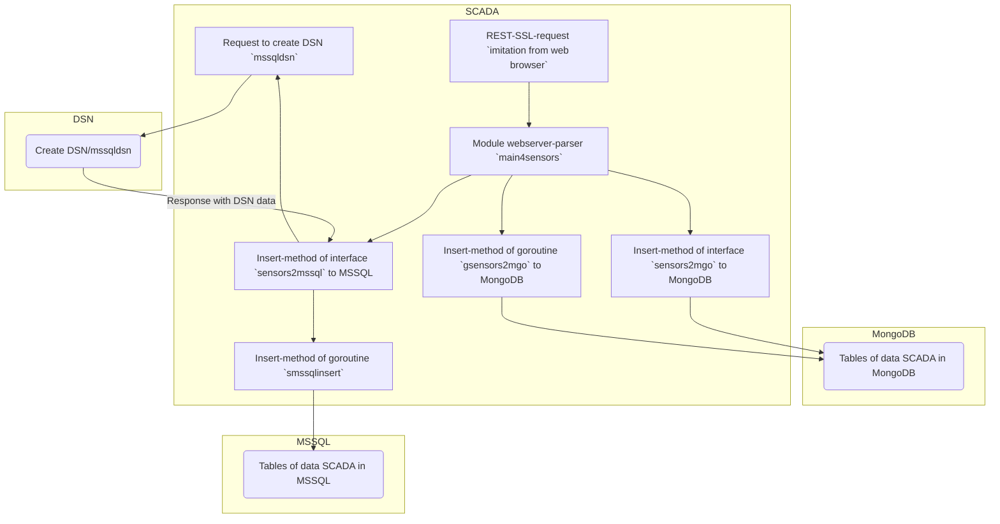

## scada
### Ru

Base of idea to [Dallas DS18B20 Thermometer Prometheus Exporter](https://github.com/samkalnins/ds18b20-prometheus-exporter). Thanks him!

Основной вебсервер демо модуль `main4sensors` реализует код парсинга https-запросов, вызов методов через интерфейс или goroutine, для получения данных температуры с датчика Dallas и записи их в MongoDB или MSSQL.   
Демо код читает данные температуры из готового, тестового файла драйвера, датчика Dallas.  
В модуле приведен и закомментирован код, для получения данных из реального файла драйвера для unix.    
 

***Схема обмена данными (scheme exchange of data):***

Для проверки, запустить модуль `main4sensors`, из строки браузера создать запрос:

	http://localhost:8443

### En

The main web server demo module `main4sensors` containts https-requests parsing code, calling methods via an interface or goroutine, to get temperature data from a Dallas sensor and write it to MongoDB or MSSQL.  
The demo code reads the temperature data from the test of driver file, the Dallas sensor.  
The module contains and commented out the code to get data from the real driver file for unix.  
Visualization of Benchmark testing for both cases is given.

To check, start the `main4sensors` server and create a test request from the browser line: 

	http://localhost:8443
